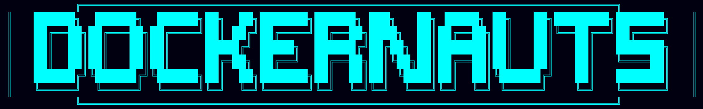

Created for a Boot.dev hackathon,

Is A Terminal-Based Space Exploration Game
Dockernauts is an immersive ASCII-based space exploration game built with Python and Textual. Navigate through a procedurally generated universe, discover colorful planets, manage resources, and build your space empire!

## Features

### Infinite Space Exploration

Procedurally Generated Universe: Explore an endless cosmos with algorithmically placed planets and star systems
Smooth Panning: Navigate seamlessly through space with arrow key controls
Sector-Based Coordinates: Track your location with a sector-based positioning system

### Interactive Planets

Clickable Planets: Click on any planet to interact with it
Diverse Planet Types: Discover 8 different planet types, each with unique characteristics:

- Desert Worlds (Yellow)
- Ocean Worlds (Blue)
- Forest Worlds (Green)
- Ice Worlds (Cyan)
- Volcanic Worlds (Red)
- Gas Giants (Purple)
- Rocky Worlds (White)
- Crystal Worlds (Magenta)

### Resource Management (WIP)

Real-time Status Bar: Monitor your resources at all times

- Food supplies
- Gold reserves
- Metal stockpiles
- Current sector coordinates

## Visual Design

Rich ASCII Art: Beautifully crafted planet designs using Unicode characters
Color-Coded Elements: Each planet type has its own distinctive color
Starfield Background: Procedurally generated stars create an immersive space atmosphere
Responsive UI: Clean, terminal-optimized interface that works on any screen size

## Installation

### Prerequisites

Python 3.11+
[Poetry](https://python-poetry.org/docs/)
Terminal with Unicode support
Mouse support (for planet interaction)

Setup
bash# Clone the repository
git clone https://github.com/eallender/Dockernauts.git
cd dockernauts

### Install dependencies
poetry install

### Run the game
poetry run python src/main.py

## How to Play
Controls

Arrow Keys: Pan around the universe

⬆️ Move up
⬇️ Move down
⬅️ Move left
➡️ Move right

Mouse Click: Interact with planets
Q: Quit/Go back

Getting Started

Launch the game and you'll start in space sector (0,0)
Use arrow keys to explore the universe
Watch the sector coordinates change as you move
Click on any planet you discover to interact with it
Monitor your resources in the status bar
Discover different planet types and conquer the galaxy!

### Tips

Each sector is 100x100 units - planets are distributed across sectors
Different planet types may offer different resources and opportunities
Keep an eye on your resource levels as you explore
The universe is infinite - there's always more to discover!

### Key Features

Procedural Generation: Uses seeded random generation for consistent universe
Efficient Rendering: Only renders visible areas for smooth performance
Event-Driven Architecture: Clean separation between UI and game logic
Modular Design: Easy to extend with new planet types and game mechanics

## Development Roadmap
Planned Features

- Docker planet containers
    - claimed planets will spawn docker containers
    - each container will have its own resources and send resources periodically to the mothership via NATS
    - planet resource production will be upgradable
- Planet Interaction Menus: Detailed planet information and resource extraction
- Trading System: Buy and sell resources between planets
- Planet Upgrades
- Missions & Quests: Structured gameplay objectives
- Save/Load System: Persist your progress

Technical Improvements

- Performance Optimization: Enhanced rendering for larger universes
- Sound Effects: Audio feedback for actions
- Advanced Planet Generation: More sophisticated planet characteristics